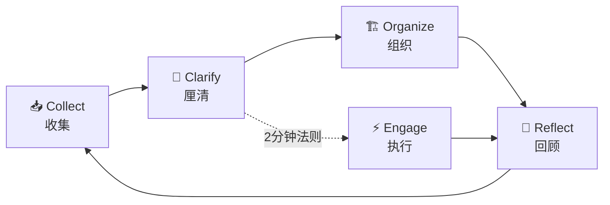

# 🚀 Douzi — AI-Powered GTD Knowledge Board

> **闭眼往 Inbox 扔想法，剩下的交给 AI 和 GTD 方法论。**

Douzi 是一个基于 **GTD (Getting Things Done)** 方法论的个人知识管理系统，通过 **AI 辅助整理** + **Markdown 双向链接** + **零依赖 Web 看板**，让知识管理变得前所未有的简单。

---

## ✨ 四大核心特点

### 1. 🎯 正宗 GTD 方法论实践

完整实现 David Allen 的 GTD 五步工作流，从收集到回顾形成闭环：



| GTD 步骤 | Douzi 实现 |
|---------|-----------|
| **收集** Capture | 零阻力的 `inbox/` 收件箱，有想法就记录 |
| **厘清** Clarify | AI 自动分类 →  Inbox → Next/Waiting/Project |
| **组织** Organize | 结构化目录 + 优先级 + 标签系统 |
| **回顾** Reflect | 每日回顾模板，养成复盘习惯 |
| **执行** Engage | Web 看板可视化，一眼看到下一步行动 |

### 2. 🤖 AI 辅助自动分流

**不再需要手动整理收件箱！** 只需闭眼往 Inbox 里扔想法，AI 帮你完成分流：

- 📥 **自动分类** — AI 判断每条内容是 2 分钟能做完、需要等待他人、还是多步骤项目
- 🏷️ **自动打标** — 根据内容语义自动添加优先级和标签
- 📋 **生成下一步行动** — 将模糊想法拆解为具体可执行任务
- 🔄 **一键整理** — 点击看板上的「✨ 一键整理」按钮，或运行 `ai-process.mjs`，5 分钟搞定过去需要 30 分钟的手动整理

```bash
# 用法：先往里扔想法
cat > knowledge-base/gtd/inbox/2026-04-29-新想法.md << 'EOF'
---
title: "调研竞品方案"
status: "inbox"
priority: "P2"
tags: ["调研"]
---

# 调研竞品方案

需要比较 3 个竞品...
EOF

# 方法 1：终端直接运行整理
node ai-process.mjs --file 2026-04-29-新想法.md

# 方法 2：Web 看板中点击「✨ 一键整理」按钮
```

### 3. 🔗 Obsidian / Foam 无缝衔接

知识库采用 **标准 Markdown + 双向链接** 规范，与 Obsidian 生态完美兼容：

- ✅ **Obsidian** — 直接打开 `knowledge-base/` 文件夹即可
- ✅ **Foam (VS Code)** — 直接作为 Foam workspace 使用
- ✅ **标准 front matter** — YAML 元数据格式与 Zettelkasten 兼容
- ✅ **双向链接** — `[[页面名]]` 语法，构建个人知识图谱
- ✅ **标签系统** — `#标签` 语法，支持多级分类

```markdown
---
title: "AI 搜项目规划"
status: "project"
priority: "P0"
created: 2026-04-28
updated: 2026-04-28
tags: ["AI", "项目"]
---

# AI 搜项目规划

## 关联项目
- 详见 [[AI搜-设计规划器问题归因体系]]
- 参考 [[个人知识管理体系]]

## 关键指标
- [[AI搜Q2关键落地项和过程指标]]
```

### 4. 🌐 零依赖 Web 看板

纯 JavaScript 实现，**一个命令启动**，无需任何构建工具：

```bash
# 只需 Node.js，零依赖
node server.mjs

# 打开 http://localhost:5000 即可使用
open http://localhost:5000
```

**看板功能：**
- 📊 看板视图 — 按 GTD 状态分列展示所有任务
- 🔍 全文搜索 — 实时过滤卡片
- ➕ 快速添加 — 每列下方直接新建任务
- 📦 一键归档 — 已完成项批量归档
- ✏️ 在线编辑 — 弹窗内直接编辑 Markdown
- 🏷️ 标签筛选 — 按标签过滤视图
- ✨ 一键整理 — 调用 Gemini AI 自动分类 Inbox
- 📱 移动友好 — 手机浏览器随时查看

---

## 🚀 快速开始

### 前提条件

- Node.js 18+ （仅此而已，零外部依赖）
- Gemini CLI 工具（用于 AI 整理功能）

### 方式一：一键安装（推荐 macOS）

安装 macOS 菜单栏应用 + 命令行工具，之后随时通过 Launchpad 或终端启动：

```bash
# 一键安装
curl -fsSL https://raw.githubusercontent.com/seuwangcy/Douzi/main/install.sh | bash

# 启动（任选一种）
douzi              # 命令行
open -a Douzi      # Launchpad / 应用文件夹
```

安装后，Douzi 会：
- 常驻状态栏（⦿ 图标）
- 自动管理 Node.js 服务
- 支持 ⌘N 快速添加待办、⌘O 打开看板

### 方式二：手动启动（适合浏览器使用）

```bash
# 1. 克隆仓库
git clone https://github.com/seuwangcy/Douzi.git
cd douzi

# 2. 启动看板（零依赖）
node server.mjs

# 3. 浏览器访问
open http://localhost:5000
```

### 用 Obsidian 打开

```bash
# 将 knowledge-base/ 添加到 Obsidian 作为 vault
# 或使用 Foam 插件在 VS Code 中打开
```

---


---

## 🍎 macOS 菜单栏应用

除了浏览器访问，Douzi 还提供了原生 macOS 菜单栏应用，常驻系统托盘，一键管理看板服务。

### 功能

| 菜单项 | 快捷键 | 作用 |
|--------|--------|------|
| ✨ 快速添加待办 | ⌘N | 弹出 SwiftUI 窗口，输入内容直接写入 Inbox |
| 🌐 打开看板 | ⌘O | 自动启动服务（如未运行），浏览器打开 localhost:5000 |
| 🧠 一键整理 Inbox | — | 调用 AI 自动分类 Inbox 中的待办 |
| 服务状态 | — | 实时显示 Node.js 服务是否运行 |
| 🔄 重启服务 | ⌘R | 终止并重新启动 `node server.mjs` |
| 🛑 停止服务 | — | 终止 Node.js 进程 |
| 退出 Douzi | ⌘Q | 停止服务并退出菜单栏应用 |

### 编译运行

```bash
cd macos-tray
swift build
./.build/debug/DouziMenuBar
```

应用启动后会自动检测并启动 `node server.mjs`（如尚未运行），状态栏出现 `⦿` 图标，点击即可展开菜单。

> 详细文档见 [docs/macos-menu-bar.md](docs/macos-menu-bar.md)
## 📂 目录结构

```
douzi/
├── server.mjs              # 零依赖 Web 看板服务器
├── ai-process.mjs          # AI 辅助整理脚本（支持 CLI + 模块导入）
├── knowledge-base/
│   └── gtd/
│       ├── _README.md      # GTD 使用说明
│       ├── _TEMPLATE.md    # 任务模板
│       ├── inbox/          # 📥 收件箱 - 想法先扔这里
│       ├── next_actions/   # 🎯 下一步行动 - 具体可执行任务
│       ├── waiting_for/    # ⏳ 等待他人 - 依赖外部的事项
│       ├── projects/       # 📋 项目 - 多步骤目标
│       ├── done/           # ✅ 已完成 - 刚完成的任务
│       ├── archived/       # 📦 已归档 - 长期保存的完成项
│       ├── reference/      # 📚 知识参考 - 文献笔记、资料
│       └── daily_review/   # 📝 每日回顾 - 日/周复盘
├── macos-tray/            # 🍎 macOS 菜单栏应用
│   ├── Package.swift
│   └── Sources/DouziMenuBar/
├── docs/                   # 📖 项目文档
├── LICENSE                 # MIT License
└── .gitignore
```

---

## 💡 使用场景

### 场景 1：通勤路上的灵感
1. 手机上打开浏览器 → 访问 NAS 或电脑部署的看板地址
2. 在 Inbox 栏点击「+」，输入想法
3. 回到家后点击「✨ 一键整理」，AI 自动分类到对应目录

### 场景 2：项目管理
1. 在 `next_actions/` 中查看今日待办
2. 关联到 `projects/` 中的大项目（使用双向链接）
3. 完成后移动到 `done/`，周末批量归档

### 场景 3：知识积累
1. 在 `reference/` 中用 Markdown 记录技术笔记
2. 用 `[[双向链接]]` 关联相关知识点
3. Obsidian 中自动生成知识图谱

---

## 🔧 进阶用法

### 自定义看板服务器端口

```bash
# 修改 server.mjs 底部的 PORT 变量
PORT=8080 node server.mjs
```

### 在 NAS/Docker 上部署

```yaml
# docker-compose.yml (可选)
version: "3"
services:
  douzi:
    image: node:20-alpine
    working_dir: /app
    volumes:
      - ./knowledge-base:/app/knowledge-base
      - ./server.mjs:/app/server.mjs
      - ./ai-process.mjs:/app/ai-process.mjs
    command: node server.mjs
    ports:
      - "5000:5000"
```

### AI 整理工作流

**方式一：Web 看板一键触发**
打开看板 → 点击右上角「✨ 一键整理」→ AI 自动处理 → 弹窗显示结果 → 页面自动刷新

**方式二：命令行直接运行**
```bash
# 查看 inbox 中有多少未处理项
ls knowledge-base/gtd/inbox/ | wc -l

# 全部整理
node ai-process.mjs

# 只整理指定文件
node ai-process.mjs --file 2026-04-29-新想法.md

# 试运行（预览不实际移动）
node ai-process.mjs --dry-run
```

**方式三：代码中导入使用**
```javascript
import { organizeInbox } from './ai-process.mjs';
const { result } = await organizeInbox({ dryRun: false, baseDir: './knowledge-base/gtd' });
console.log(result);
```

**方式四：定时自动整理**
```bash
# 加入 cron，每天 20:00 自动执行
crontab -e
0 20 * * * cd /path/to/douzi && node ai-process.mjs
```

---

## 📖 文档

- [GTD 工作流指南](docs/gtd-workflow.md)
- [AI 辅助整理配置](docs/ai-setup.md)
- [Obsidian / Foam 集成](docs/obsidian-integration.md)
- [macOS 菜单栏应用](docs/macos-menu-bar.md)
- [自定义与扩展](docs/customization.md)

---

## 🤝 贡献

欢迎提交 Issue 和 Pull Request！

1. Fork 本仓库
2. 创建功能分支 (`git checkout -b feature/amazing-feature`)
3. 提交更改 (`git commit -m 'Add amazing feature'`)
4. Push 到分支 (`git push origin feature/amazing-feature`)
5. 创建 Pull Request

---

## 📄 许可

MIT License — 详见 [LICENSE](LICENSE)

---

## 🌟 致谢

- David Allen — Getting Things Done 方法论
- Obsidian — 双向链接知识库的标杆
- Node.js — 零依赖轻量级服务器的基石
