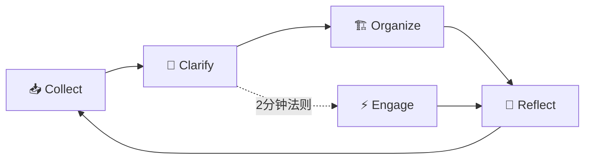

# Douzi — AI驱动的事务和知识管理器
> **有想法只管扔进 Inbox，剩下的让 AI 来安排。**

Douzi 不是又一个 GTD 工具——它是对 GTD 方法论的 **一次进化**。原生集成 AI 分流 + 菜单栏秒级入口 + 零依赖看板，让收集 → 厘清 → 组织 → 回顾 → 执行的每一个环节都变得前所未有的轻松。

---

## 🚀 快速开始

### 前提条件

- Node.js 18+（仅此而已，零外部依赖）
- **AI 整理功能需要本地 AI CLI 工具**（二选一）：
  - [Gemini CLI](https://github.com/google/gemini-cli)：`npm install -g @google/gemini-cli`
  - [Claude Code](https://docs.anthropic.com/en/docs/claude-code)：`npm install -g @anthropic-ai/claude-code`
- 通过配置文件选择 AI 提供商（见下方说明）

### AI 提供商配置

Douzi 支持选择不同的本地 AI CLI 工具进行整理。通过配置文件指定：

```bash
# 配置文件位置
~/.douzi/config.json
```

**配置格式：**
```json
{
  "aiProvider": "gemini"
}
```

**可选值：**
| 值 | 说明 |
|----|------|
| `gemini` | 使用 Google Gemini CLI（默认） |
| `claude` | 使用 Anthropic Claude Code |

> 配置文件不存在时，默认使用 `gemini`。请确保所选的 AI CLI 工具已在本机安装并可正常调用。

### ⭐ 推荐：一键安装（macOS）

安装 macOS 菜单栏应用 + 命令行工具，之后随时通过状态栏图标或终端启动：

```bash
# 一键安装
curl -fsSL https://raw.githubusercontent.com/seuwangcy/Douzi/main/install.sh | bash

# 启动（任选一种）
douzi              # 终端命令行
douzi update       # 更新到最新版本
douzi uninstall    # 完全移除 Douzi
open -a Douzi      # Launchpad / 应用文件夹
```

安装后，Douzi 常驻 **菜单栏（状态栏图标 ⦿）**：
- **⌘N** 快速添加待办，秒进 Inbox
- **⌘O** 一秒打开看板
- 右键「🧠 一键整理 Inbox」，AI 自动分流

### 方式二：手动启动（浏览器使用）

```bash
git clone https://github.com/seuwangcy/Douzi.git
cd douzi
node server.mjs           # 零依赖启动看板
open http://localhost:5000
```

### 用 Obsidian 打开

```bash
# 将 ~/.douzi/knowledge-base/ 添加到 Obsidian 作为 vault
# 或使用 Foam 插件在 VS Code 中打开
```

## 🔄 维护管理

### 更新 Douzi

安装后，随时拉取最新版本并重新编译：

```bash
# 方式一：CLI 命令（推荐）
douzi update

# 方式二：运行更新脚本
bash ~/.douzi/update.sh

# 方式三：从项目目录手动更新
cd ~/.douzi
git pull
cd macos-tray
swift build
```

更新脚本会自动：
- 拉取最新代码（保留本地修改）
- 重新编译 macOS 菜单栏应用
- 更新命令行启动器
- 重启运行中的进程（如菜单栏应用、Node.js 服务）

### 卸载 Douzi

想移除 Douzi？运行卸载脚本即可彻底清理：

```bash
# 方式一：CLI 命令（推荐）
douzi uninstall

# 方式二：运行卸载脚本
bash ~/.douzi/uninstall.sh
```

卸载脚本会移除以下内容：
| 清理项 | 说明 |
|--------|------|
| `~/.douzi/` | 安装目录（仓库代码 + 构建产物） |
| `~/.local/bin/douzi` | 命令行启动器 |
| `~/Applications/Douzi.app` | Launchpad 启动入口 |
| shell PATH | 移除 `~/.local/bin` 路径添加 |
| crontab | 移除与 Douzi 相关的定时任务 |
| 运行中的进程 | 停止菜单栏应用和 Node.js 服务器 |

> 交互模式会询问是否保留 `~/.douzi/knowledge-base/` 下的 GTD 数据。使用 `curl | bash` 一键卸载时，所有数据将被移除。

### 查看安装信息

```bash
# 查看安装位置
ls -la ~/.douzi

# 查看当前版本
cd ~/.douzi && git log --oneline -1

# 查看运行状态
pgrep -x "DouziMenuBar" && echo "菜单栏应用运行中" || echo "菜单栏应用已停止"
lsof -i :5000 -P -n 2>/dev/null | grep LISTEN && echo "看板服务运行中" || echo "看板服务未启动"
```

---
---

## 🛠️ 使用方法

### 基础：两秒上手

**Step 1 — 扔想法**
有灵感了？双击状态栏图标（⦿）→ `⌘N` → 输入，搞定。

或者直接在看板 Inbox 列点「+」、或在终端创建 Markdown 文件，想怎么来怎么来。

**Step 2 — AI 整理**
做完 Step 1，你的一天就从这里分叉：

- 传统 GTD：你得打开收件箱逐条阅读、判断类别、手动移动文件，30 分钟起步。
- **Douzi**：点一下菜单栏「🧠 一键整理 Inbox」（或看板右上角「✨ 一键整理」），AI 自动分类、打标、生成下一步行动，5 秒出结果。

**Step 3 — 执行与回顾**
看板 `next_actions/` 列展示你今天该做什么。完成了拖入 `done/`，周末一键归档。

### 进阶：5 种 AI 整理触发方式

Douzi 的 AI 分流能力可以从任意入口触达，确保"整理"永远不会成为你的阻碍：

| 方式 | 操作 | 适用场景 |
|------|------|---------|
| 🍎 **菜单栏一键整理** | 状态栏图标 → 点击「🧠 一键整理 Inbox」 | 最快捷，日常随手用 |
| 🌐 **看板一键整理** | 浏览器看板 → 右上角「✨ 一键整理」 | 正在看板时顺手整理 |
| 💻 **命令行整理** | `node ai-process.mjs` | 批量处理、脚本集成 |
| 🔌 **代码导入整理** | `import { organizeInbox }` | 集成到其他工具 |
| ⏰ **定时自动整理** | `crontab -e` + `node ai-process.mjs` | 每天固定时间自动整理 |

**命令行示例：**

```bash
# 全部整理
node ai-process.mjs

# 只整理指定文件
node ai-process.mjs --file 2026-04-29-想法.md

# 试运行（预览不实际移动）
node ai-process.mjs --dry-run
```

### 🍎 macOS 菜单栏功能

| 菜单项 | 快捷键 | 作用 |
|--------|--------|------|
| ✨ 快速添加待办 | ⌘N | 弹出 SwiftUI 窗口，输入内容直接写入 Inbox |
| 🌐 打开看板 | ⌘O | 自动启动服务（如未运行），打开 localhost:5000 |
| 🧠 一键整理 Inbox | — | 调用 AI 自动分类 Inbox 中的待办 |
| 服务状态 | — | 实时显示 Node.js 服务是否运行 |
| 🔄 重启服务 | ⌘R | 终止并重新启动 `node server.mjs` |
| 🛑 停止服务 | — | 终止 Node.js 进程 |
| 退出 Douzi | ⌘Q | 停止服务并退出菜单栏应用 |

> 菜单栏应用详细编译及使用指南见 [docs/macos-menu-bar.md](docs/macos-menu-bar.md)

### 自定义看板端口

```bash
PORT=8080 node server.mjs
```

### 自定义知识库路径（可选）

默认情况下，文件存储在 `~/.douzi/knowledge-base/gtd/`。可通过环境变量自定义：

```bash
DOUZI_KNOWLEDGE_BASE_DIR=~/my-kb/gtd node server.mjs
DOUZI_KNOWLEDGE_BASE_DIR=~/my-kb/gtd node ai-process.mjs
```
```

---

## ✨ 核心特点

### 1. 🤖 AI 让 GTD "厘清"环节降本 90%

**这是 Douzi 对 GTD 方法论的最大进化。**

传统 GTD 最耗时的"厘清"（Clarify）环节——逐条判断每条想法是 2 分钟任务、等待事项还是复杂项目——被 AI 完全接管：

- 📥 **自动分类** — AI 判断内容性质，写入对应目录
- 🏷️ **自动打标** — 根据语义添加优先级和标签
- 📋 **生成下一步行动** — 模糊想法 → 具体可执行任务
- 🔄 **5 种触发方式**（菜单栏 / 看板 / 终端 / 代码 / 定时）

过去手动整理 30 分钟的工作量，现在只需要一个点击，5 秒完成。

### 2. 🎯 正宗 GTD 五步工作流

完整实现 David Allen 的五步闭环：



| GTD 步骤 | Douzi 实现 |
|---------|-----------|
| **收集** Capture | `inbox/` 收件箱 + 菜单栏 ⌘N 秒级输入 |
| **厘清** Clarify | AI 自动分类，无需手动判断 |
| **组织** Organize | 结构化目录 + 优先级 + 标签系统 |
| **回顾** Reflect | 每日回顾模板，培养复盘习惯 |
| **执行** Engage | Web 看板 + 菜单栏，一眼看到下一步 |

### 3. 🔗 Obsidian / Foam 无缝衔接

纯 Markdown + 双向链接，与 Obsidian 生态完美兼容：

- ✅ **Obsidian** — 直接打开 `~/.douzi/knowledge-base/` 文件夹
- ✅ **Foam (VS Code)** — 作为 Foam workspace 直接使用
- ✅ **标准 front matter** — YAML 元数据格式
- ✅ **双向链接** — `[[页面名]]` 语法，构建知识图谱
- ✅ **标签系统** — `#标签` 语法，多级分类

### 4. 🌐 零依赖 Web 看板

纯 JavaScript 实现，一个命令启动：

```bash
node server.mjs
open http://localhost:5000
```

**看板功能：** 按 GTD 状态分列展示 · 全文搜索 · 快速添加 · 一键归档 · 在线编辑 · 标签筛选 · 一键整理 · 移动友好

---

## 💡 真实场景

**通勤路上的灵感** → 菜单栏 ⌘N 扔进 Inbox → 到家一键 AI 整理 → 看板上整整齐齐

**日清日毕** → 打开看板看 `next_actions/` → 完成拖入 `done/` → 下班前一键清空 Inbox

**多步骤项目** → AI 自动识别归入 `projects/` → `[[双向链接]]` 关联子任务 → 一张图看懂项目全局

---

## 📁 存储架构设计

Douzi 采用**平台与数据分离**的架构设计：

```
~/.douzi/                    # 安装目录（管理平台代码）
└── knowledge-base/         # 用户知识库（个人数据，不随项目跟踪）
    └── gtd/
        ├── inbox/           # 📥 收件箱
        ├── next_actions/    # 🎯 下一步行动
        ├── waiting_for/     # ⏳ 等待他人
        ├── projects/        # 📋 项目
        ├── done/            # ✅ 已完成
        ├── archived/        # 📦 已归档
        ├── reference/       # 📚 知识参考
        └── daily_review/    # 📝 每日回顾
```

### 设计原则

| 组件 | 存储位置 | 说明 |
|------|----------|------|
| **管理平台** | `~/.douzi/` | 代码、构建产物，可通过 git 更新 |
| **知识库** | `~/.douzi/knowledge-base/` | 用户个人数据，不随项目跟踪 |

### 目录结构说明

```
douzi/
├── server.mjs              # 零依赖 Web 看板服务器
├── ai-process.mjs          # AI 辅助整理脚本（CLI + 模块导入）
├── install.sh              # macOS 一键安装脚本
├── update.sh              # 🆕 更新脚本（拉取最新 + 重新编译）
├── uninstall.sh           # 🗑️ 卸载脚本（完整清理）
├── macos-tray/             # 🍎 macOS 菜单栏应用（状态栏入口）
├── docs/                   # 📖 文档
│   ├── gtd-workflow.md
│   ├── ai-setup.md
│   ├── obsidian-integration.md
│   ├── macos-menu-bar.md
│   ├── customization.md
│   ├── maintenance.md         # 🔄 更新与卸载指南
│   └── templates/          # 文档模板
├── LICENSE                 # MIT License
└── .gitignore

# 用户数据（存储在 ~/.douzi/knowledge-base/，不随项目跟踪）
```

---

## 📖 文档

- [GTD 工作流指南](docs/gtd-workflow.md)
- [AI 辅助整理配置](docs/ai-setup.md)
- [Obsidian / Foam 集成](docs/obsidian-integration.md)
- [macOS 菜单栏应用](docs/macos-menu-bar.md)
- [维护管理](docs/maintenance.md)
- [自定义与扩展](docs/customization.md)

---

## 🤝 贡献

欢迎提交 Issue 和 Pull Request！

1. Fork 本仓库
2. 创建功能分支 (`git checkout -b feature/amazing-feature`)
3. 提交更改 (`git commit -m 'Add amazing feature'`)
4. Push 到分支 (`git push origin feature/amazing-feature`)
5. 创建 Pull Request

## 📄 许可

MIT License — 详见 [LICENSE](LICENSE)

## 🌟 致谢

- David Allen — Getting Things Done 方法论
- Obsidian — 双向链接知识库的标杆
- Node.js — 零依赖轻量级服务器的基石
- Google Gemini API — AI 整理能力
