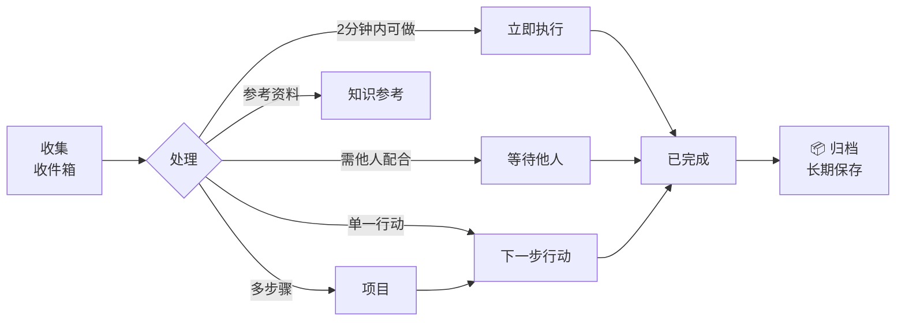

# GTD 个人知识管理看板

## 文件夹结构说明

```
knowledge-base/gtd/
├── _README.md              ← 本文件
├── _TEMPLATE.md            ← 任务模板
├── _INDEX.md               ← 自动生成的索引
├── inbox/                  ← 收件箱：临时存放所有新想法
├── next_actions/           ← 下一步行动：具体可执行的任务
├── waiting_for/            ← 等待他人：需要别人回复/完成的事项
├── projects/               ← 项目：需要多个步骤才能完成的目标
├── done/                   ← 已完成：已完成的任务
├── archived/               ← 已归档：从已完成中归档的旧任务
├── reference/              ← 知识参考：文档、笔记、资料链接
└── daily_review/           ← 每日回顾：周/日计划与反思
```

## 工作流



## 使用方式

1. **记录新想法** → 在 `inbox/` 新建 `.md` 文件
2. **处理收件箱** → 定期将收件箱内容归类到对应文件夹
3. **归档已完成项** → 在看板弹窗中点击「📦 归档」按钮，任务移至 `archived/`
4. **每日复盘** → 在 `daily_review/` 写日志
5. **查看看板** → 运行 `node server.mjs` 或 `python3 server.py`，然后在浏览器打开

## 命名规范

- 文件名：`YYYY-MM-DD-简短描述.md`
- 每个文件使用 front matter (YAML header) 标记元数据

## 看板操作

- **新增任务**：每列标题下方点击「+ 新增」
- **移动任务**：点击卡片 → 弹窗中选择「移至...」
- **归档已完成**：已完成卡片弹窗中点击「📦 归档」
- **编辑文件**：弹窗中点击「✏️ 编辑文件」
- **搜索**：顶栏搜索框
